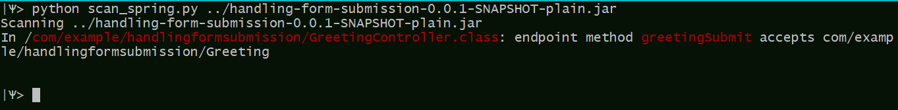

# spring-tools

### Overview

The SpringShell (CVE-2022-22965) vulnerability may affect **some** web applications using Spring Framework, but requires a number of conditions to be exploitable. One specific condition which may be rather rare (and therefore render most applications non-exploitable in practice) is the existence of Spring endpoints which bind request parameters to a non-primitive (Java Bean) type. This tool can be used to scan **compiled** code and verify whether such endpoints exist in the codebase.

Currently this alerts on all non-primitive arguments. As the precise list of vulnerable types becomes clearer, the tool will be updated.

------

## Usage instructions

### `scan_spring.py`

The tool requires Python 3.

##### Dependencies installation

```
pip install -r requirements.txt
```

##### Usage

```
python scan_spring.py root-folder [-quiet] [-exclude folder1 folder2 ..]
```

or

```
python scan_spring.py root-archive [-quiet] [-exclude folder1 folder2 ..]
```

The tool will scan `root_folder` recursively for `.jar` and `.war` files; in each located archive the tool examines the `.class` files for methods annotated with `RequestMapping` / `GetMapping` /`PostMapping` etc., and reports the occurrence if the argument types of the method are not primitive.

With `-quiet` flag, error messages (files not found/ archives failed to open/ password protected archives) are muted.

Folders appearing after `-exclude` (optional) are skipped.


